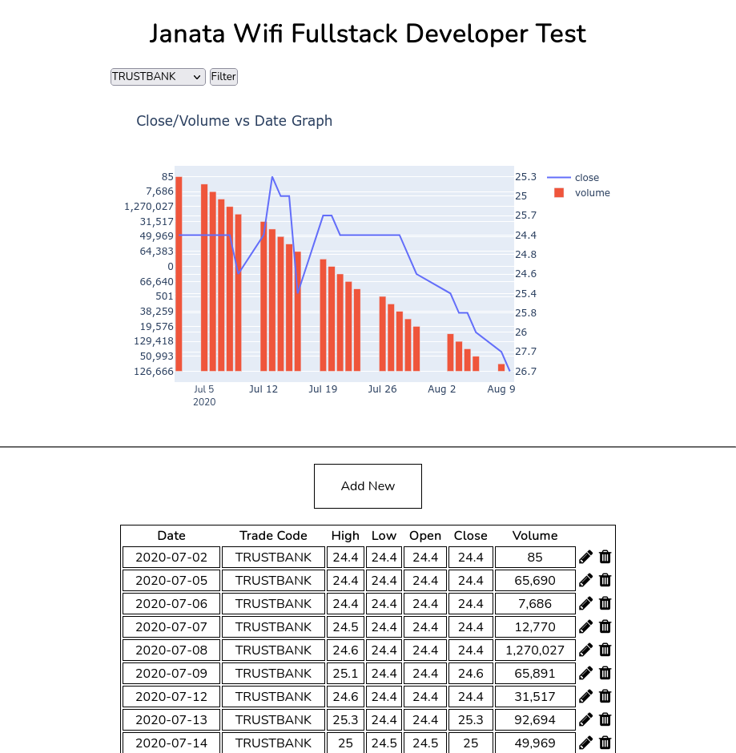

# Janata Wifi: Full Stack Developer Test
_SQL Approach_

### What did I learn

Since I did not implement the CRUD operations on the JSON approach, figuring out on how to enact that was my first learning experience. Youtube videos helped me in learning and emulating what what they did on this project. 

I learnt to migrate json data to sqlite database. Although I worked on an sql database during my DBMS course, this gave me a good refresher and learnt the nuances of sqlite database. 
Despite having multiple graph plotting options, I chose plotly graphing library to plot themulti-axis line and bar chart. 

### Challenges I faced

Learning to migrate JSON data into sqlite database costed me several hours scouring through different videos, articles and stackoverflow threads. But finally, I figured out how to load the data into sqlite database after some preprocessing. 

I did the preprocessing using a python script which can be found inside the `json_to_sqlite_migration` folder. I kept the processed json file in the folder as well just in case you would want to inspect it. 

Visualizing the data into a graph was the most time consuming part of the process, because I initially wanted to implement the graph using the matplotlib library but unfortunately I was taking too much time trying to figure out how to do so and since I had to prepare for my exam as well, time was of the essence. 

Plotly worked out well for me and after reading its documentation and some videos, I implemented it onto the homepage. 

I initially intented to make the `home` function in `views.py` atomic and creating a different function for the chart but I failed in all the attempts as I could not render both the table and the chart request on the webpage. 

P.S: I wanted to style the _Add New_ and _Update_ page but was limited by both the time constraint and my academic pressure.
