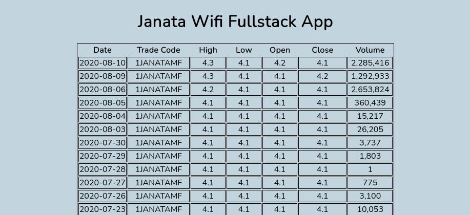

# Janata Wifi: Full Stack Developer Test
_JSON Approach_

### What did I learn

Before doing this developer test, I had no knowledge or experience in web development with Django, but I did have experience writing code in python and intermediate experience in web development using Javascript and the MERN stack.

I learnt that a major difference between web development with Django and MERN is that the former uses a lot of boilerplate and is provides me with a lot of tools right from the get go.

During my learning experience, I learn the internal functionalities of `model.py`,`settings.py`,`urls.py` and so on. 
I also learnt how differently Django handles html pages and css styles. Unlike the components in React, Django uses templates and for styling and other file imports, the use of static is heavily relied upon.

I initially had difficulty in associating the json file into the Django environment, but after several google searches and going through the documentation, I managed to display the json data using the json library.

### Challenges I faced

The biggest challenge I had to go through was time management because the developer test mail was sent to me exactly during my last semester final week. 

I would say learning a new framework was a bit of stress for me while studying for my exams, but with careful time management - I managed to pull off a somewhat satisfactory result.

What I wish I could have done better is styling the website a bit more with better UI/UX in mind, make the code cleaner by removing smelly code and adhering to pythonic conventions 

Another improvement that I wanted to implement was to make it responsive. 
